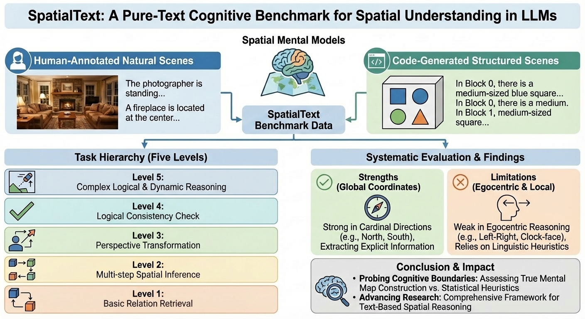

# 🧠 SpatialText: A Pure-Text Cognitive Benchmark for Spatial Understanding in Large Language Models

## 📘 Overview

SpatialBench is a benchmark designed to systematically evaluate the spatial reasoning capabilities of large language models (LLMs). While modern LLMs demonstrate strong performance on linguistic and logical tasks, their ability to understand and reason about spatial configurations remains underexplored.

This benchmark introduces carefully designed spatial reasoning tasks, including structured scene descriptions and object-block configurations. The evaluation framework measures model performance through standardized prompting and deterministic generation, providing reproducible and comparable results across models.

SpatialBench aims to:

- Assess how well LLMs understand spatial relationships
- Identify common reasoning failures in spatial scenarios
- Provide a unified evaluation pipeline for fair model comparison
- Support future research on spatial cognition in language models

We hope this benchmark facilitates deeper investigation into spatial reasoning and contributes to the development of more robust and spatially-aware language models.




## 📊 Results Summary

Comprehensive evaluation across models and task categories demonstrates that spatial reasoning remains a bottleneck for contemporary LLMs. Although strong performance is observed in low-level relational tasks, models struggle with compositional, multi-object, and hierarchical spatial reasoning. Performance variance across task types further indicates limited generalization beyond surface pattern matching.

### Human-Annotated (Accuracy %)

| Model                        | Egocentric | Allocentric | Hybrid | Total |
| ---------------------------- | ---------- | ----------- | ------ | ----- |
| DeepSeek-R1-Distill-Llama-8B | 52.17      | 59.31       | 36.06  | 48.66 |
| OpenPangu-Embedded-7B-V1.1   | 52.17      | 81.39       | 64.42  | 71.34 |
| Qwen3-8B                     | 56.52      | 80.09       | 59.62  | 69.07 |
| Gemma-3-12B-IT               | 47.83      | 63.64       | 54.33  | 58.14 |
| Qwen2.5-7B                   | 41.30      | 51.52       | 43.75  | 47.22 |
| Gemma-2-9B-IT                | 39.13      | 66.23       | 55.77  | 59.18 |
| Mistral-7B-Instruct          | 32.61      | 37.23       | 25.96  | 31.96 |
| DeepSeek-v3.2                | 58.70      | 88.74       | 76.44  | 80.62 |

### Code-Generated  (Accuracy %)

| Model                        | 2D_Omniscient | 2D_Non-Omniscient | 3D_Omniscient | 3D_Non-Omniscient |
| ---------------------------- | ------------- | ----------------- | ------------- | ----------------- |
| DeepSeek-R1-Distill-Llama-8B | 46.5          | 55.0              | 49.8          | 48.5              |
| OpenPangu-Embedded-7B-V1.1   | 69.0          | 75.8              | 72.5          | 67.1              |
| Qwen3-8B                     | 85.5          | 80.0              | 78.2          | 70.4              |
| Gemma-3-12B-IT               | 62.7          | 59.8              | 61.0          | 53.3              |
| Qwen2.5-7B                   | 37.0          | 39.0              | 31.2          | 33.2              |
| Gemma-2-9B-IT                | 41.5          | 49.8              | 43.8          | 48.5              |
| Mistral-7B-Instruct          | 33.5          | 30.5              | 30.8          | 28.8              |

## 🚀 Quickstart

```bash
SpatialBench/
├── SpatialText/        # Dataset: human-annotated and code-generated spatial questions
├── Generated-Code/     # Scripts for generating structured spatial scenarios
├── Results/            # Evaluation outputs and experiment logs
├── evaluate.py         # Main evaluation entry point
├── requirements.txt    # Python dependencies
└── README.md           # Project documentation
```

### 1. Environment Setup

We recommend Python ≥ 3.9.

```bash
conda create -n spatialbench python=3.10
conda activate spatialbench
```

Install dependencies:

```bash
pip install -r requirements.txt
```

If you are using NPU:

```bash
pip install torch-npu
```

### 2. Run Benchmark

### Evaluate LSUN-Annotated Dataset

```bash
python evaluate.py \
  --dataset path/to/room_dataset.json \
  --dataset-type room \
  --output results_room.jsonl
```

### Evaluate Code-Generated Dataset

```bash
python evaluate.py \
  --dataset path/to/block_dataset.json \
  --dataset-type block \
  --output results_block.jsonl
```


### 3. Output Files

The script will produce:

* `results.jsonl` → detailed per-question predictions
* Console output including:

  * Total number of questions
  * Overall accuracy

Example output:

```
Total questions: 485
Accuracy: 0.7321
Results saved to: results.jsonl
```


### 🔁 Using a Different Model

By default, the benchmark uses:

```
deepseek-ai/DeepSeek-R1-Distill-Llama-8B
```

To evaluate another model, simply replace the `--model` argument.

### Example: Use a HuggingFace model

```bash
python evaluate.py \
  --model meta-llama/Llama-2-7b-chat-hf \
  --dataset path/to/room_dataset.json \
  --dataset-type room
```

### Example: Use a Local Model

```bash
python evaluate.py \
  --model /path/to/your/local/model \
  --dataset path/to/block_dataset.json \
  --dataset-type block
```

## Device Control

You can specify the inference device:

```bash
--device auto      # automatically detect (default)
--device cuda      # force GPU
--device npu       # NPU
```

Example:

```bash
python evaluate.py \
  --model meta-llama/Llama-2-7b-chat-hf \
  --dataset path/to/dataset.json \
  --dataset-type room \
  --device cuda
```

### 📌 Notes

* The model must support `apply_chat_template` (chat-format models recommended).
* Generation is deterministic (`do_sample=False`).
* Default max generation length: 8192 tokens.

## 📖 Citation

If you use SpatialBench in your work, please cite:

```bibtex
@inproceedings{jiang2025spatialbench,
  title={SpatialBench: Evaluating Large Language Models on Spatial Reasoning},
  author={Peiyao Jiang and Zequn Qin and Xi Li},
  print={2603.03002},
  archivePrefix={arXiv},
  primaryClass={cs.AI},
  url={https://arxiv.org/abs/2603.03002}, 
  year={2026}
}
```

